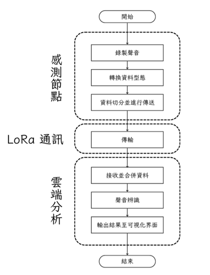
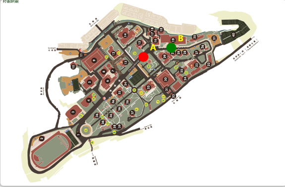

# 🌳 國科會計畫：基於 CPS 架構的廣域物聯網森林盜伐監控與警戒系統

## 💡 專案背景 (Background)
傳統依靠人力巡邏森林的監控方式，不僅耗時、成本高昂，且難以做到全天候的防護。
本專案旨在導入 **IoT Edge AI（物聯網邊緣運算）** 架構，結合 LoRa 廣域通訊技術，打造出一套低功耗、長距離、可 24 小時全天候運作的森林盜伐音訊警戒系統。

## ⚙️ 系統架構與研究方法

### 1. 邊緣運算與廣域通訊
* **硬體部署：** 於森林端部署 Raspberry Pi（樹莓派）作為邊緣收音裝置。
* **特徵工程：** 為克服 LoRa 通訊「低頻寬」的限制，系統在邊緣端直接將擷取到的環境音訊，轉換為梅爾頻率倒譜係數 (MFCC) 以大幅壓縮資料量，再透過 LoRa 模組回傳至本地端伺服器。

### 2. 機器學習模型評估與選型
於專案前期，負責評估並訓練多種機器學習演算法以尋求最佳解決方案：
* **傳統機器學習：** Random Forest, SVM
* **深度學習模型：** CNN, RNN
* **預訓練模型 (Transfer Learning)：** 導入 EfficientNet-B0, VGG19 等進行遷移學習。
經多次實驗對比，最終採用預訓練模型（EfficientNet-B0），在複雜的環境音訊中展現出最佳的特徵捕捉能力與準確率。

### 3. 本地端推論與辨識
本地端伺服器接收到 LoRa 傳回的 MFCC 數據後，將其反向還原/整理為頻譜圖格式，並輸入至訓練完成之最佳模型中，進行「電鋸聲、異常破壞聲」等盜伐事件之即時辨識。

### 4. 可視化介面
開發監控可視化介面，當模型辨識出異常音訊時，系統會立即於數位地圖上將該感測節點標示為紅色警戒，輔助林務人員精準鎖定異常區域並即時派員檢查。

## 🚀 專案結論 (Conclusion)
本專案成功結合 **LoRa 低功耗廣域通訊** 與 **Edge AI 邊緣特徵擷取**，克服了深山通訊不良的痛點。系統最終在異常音訊辨識上達到了 **95.56%** 的優異準確率，實現了低成本、高效率的智慧森林防護網。
